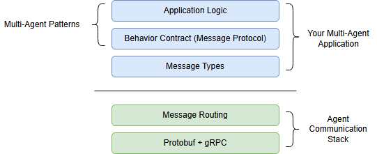
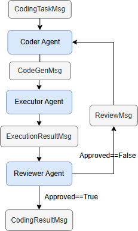

# Autogen-Core API
https://microsoft.github.io/autogen/stable/reference/python/autogen_agentchat.messages.html#module-autogen_agentchat.messages
</br>
! pip install -U autogen-core </br>
! pip install autogen-ext[openai, azure]

> Following are the core concepts in Autogen which are also foundational building blocks for any multi-agent system:
</br><li>Agents
</br><li>Agent runtime
</br><li>Messages
</br><li>Communication

> <strong>Autogen-core api</strong> is the right choice to build interactive, scalable, and distributed multi-agent system where full control of all the workflows are needed.

### Agent
In Autogen, agent is an entity which is defined by the base interface <strong>Agent</strong>. An agent has the following:</br>
* <strong>AgentID:</strong> Unique identifier</br>
* <strong>AgentMetadata:</strong> Metadata dictionary

> *AgentID uniquely identifies agent instance within an agent runtime.*</br>
AgentID has two components:</br>
AgentID = (<strong>Agent Type, Agent Key</strong>)</br></br>
<strong>Agent Key</strong> is an instance identifier for the given agent type.

Agents always communicate via messages and maintain its own states.

#### RoutedAgent
* This is a superclass which can be used to subclass agents.
* It routes messages to message handler.
* Message handlers are specified with @message_handler decorator.
* Message handler must have a <strong>message</strong> variable with proper type hint.

> <strong><u>NOTE:</u></strong> In Autogen core, agents are not directly instantiated and managed by application code rather they're created by runtime when needed and managed by runtime itself.

### Agent Runtime
Autogen core framework provides communication infrastructure called as *agent runtime*. It is an execution environment for agents and delivers messages and manages agent's lifecycle and their identities. Hence, runtime handles the creation of the agents. </br>Following are the two types of agent runtime in Autogen:
* *Standalone Agent Runtime*
* *Distributed Agent Runtime*
> <strong>SingleThreadedAgentRuntime</strong>: It's a local embedded agent runtime implementation suitable for single-process applications. It's an example of standalone agent runtime.</br>
<strong>Distributed agent runtime</strong>: It can host agents runnig on different processes or machines.

### Messages and Communications
There are two types of communications in Autogen core:
* <strong>Direct messaging:</strong> Sender must provide the recipient's agent ID. This method of messaging is suitable for scenarios where workflow is composed of inter-dependent agents. It's used for request/response scenario.
* <strong>Broadcast:</strong> One-to-many and no agent id is required. It's basically publish-subscribe model with topic and subscription.It publishes the message to a topic. This type of messaging is suitable for scenarios where workflow is composed of agents with no inter-dependencies. It cannot be used for request/response scenario.
<p>In broadcast messaging, <strong>topic</strong> and <strong>subscription</strong>  are two core concepts.</p> 

### Autogen core application stack


* The messaging and routing services that reside at the bottom of the stack are managed by agent runtime and developers don't need to do anything about it.

> <strong>Multi-agent patterns</strong> emerge from behavior contracts (message protocol). Behavior contract is formed by set of message types that agents must adhere to. Behavior contract is implemented by developers.
</br>

In the following multi-agent system:



Following are the set of message types which form behavior contract:

<div style="display: inline-block; padding: 1px 20px; background-color:rgb(255, 0, 93); color: white; border-radius: 5px; text-align: center; margin-bottom: 2px">
  CodingTaskMsg
</div></br>
<div style="display: inline-block; padding: 1px 20px; background-color:rgb(255, 0, 93); color: white; border-radius: 5px; text-align: center; margin-bottom: 2px">
  CodeGenMsg
</div></br>
<div style="display: inline-block; padding: 1px 20px; background-color:rgb(255, 0, 93); color: white; border-radius: 5px; text-align: center; margin-bottom: 2px">
  ExecutionResultMsg
</div></br>
<div style="display: inline-block; padding: 1px 20px; background-color:rgb(255, 0, 93); color: white; border-radius: 5px; text-align: center; margin-bottom: 2px">
  ReviewMsg
</div></br>
<div style="display: inline-block; padding: 1px 20px; background-color:rgb(255, 0, 93); color: white; border-radius: 5px; text-align: center; margin-bottom: 2px">
  CodingResultMsg
</div>
</br></br>

## Logging
Autogen core supports two kind of logging and uses the Python built-in logging module:
* Trace logging
* Structured logging

> Autogen has native support for *opentelemetry*.

# Explore autogen-agentchat api
! pip install -U autogen-agentchat </br>
! pip install autogen-ext[openai, azure]

```
Core Components in Autogen AgentChat:
1. Agents
2. Teams
3. Termination conditions
```

> Autogen-agentchat also supports using semantic kernel based model clients to call LLM models.

> AgentChat has various predefined message types tailored for specific purposes.
### Two high-level message types:</br>
1. <u>Agent-Agent messages</u>: All the message types in this criteria is a subclass of <strong>BaseChatMessage</strong>. <strong>TextMessage</strong> & <strong>MultiModalMessage</strong> are two message types available in this criteria.
</br></br>
2. <u>Agent's internal events and messages</u>: The messages that are internal to agents are called <i>events</i>. These events are used to inform about actions within agents and are subclass of <strong>BaseAgentEvent</strong>.

    * Events are created by agent itself.
    * Events are contained in the <strong>inner_message</strong> field of Response. 
    * Agent's final response is contained in the <strong>chat_message</strong> field of Response.

### Preset Agents in AgentChat
* AssistantAgent
* UserProxyAgent
* CodeExecutorAgent
* OpenAIAssistantAgent
* MultiModalWebSurfer
* FileSurfer
* VideoSurfer

### Teams
A team is a group of agents that work together to achieve a common goal.
* RoundRobinGroupChat
* SelectorGroupChat
* MagenticOneGroupChat

#### Agent design patterns to Create Team
1. SelectorGroupChat: 
    * A selector agent decides which agent will speak next.
    * It can use an LLM as selector which uses conversation history, name, description of agent to decide next in queue.

2. Swarm: 
    * Agents can hand off task to other agents based on their capabilities.
    * It allows agent to delegate tasks to other agents using a special tool call.
    * All agents in the Swarm team share the same message context.
    * Swarm design pattern enables agents to make local decisions about task planning, rather than relying on a central orchestrator.

> Execution of team always returns <strong>TaskResult</strong>.

### State Management
<strong>save_state()</strong> & <strong>load_state()</strong> are two methods supported by AssistantAgent and Teams to save and load the state of agents and all the agents in a given team.


### Making custom Agent Declarative
use the <i>Component</i> interface from the autogen_core api to make the configuration of components serializable to a declarative format.


# Test Questions:
1. James is a retail investor who wants to create a portfolio of stocks. He is looking for a stock screener that can help him find the best stocks to invest in. He wants to know the top 10 stocks in the US market based on their performance in the last 5 years. He's primarily interested in healthcare, infrastructure, and defense stocks. Help him create a porfolio and provide justification why it was chosen. Moreover, he wants to invest USD 100,000; hence, suggest split of this money among the selected stocks. Most importantly, he's in his 50's and has mild risk appetite. So, please suggest stocks that are not too risky and have a good track record of performance.

2. My name is james and I'm an investment advisor. I'm researching to create a porfolio of stocks for my client Graham. I'm looking for a stock screener that can help me find the best stocks to invest in. I want to know the top 10 stocks in the US market based on their performance in the last 5 years. He's primarily interested in healthcare, infrastructure, and defense stocks. Help him create a porfolio and provide justification why it was chosen. Moreover, he wants to invest USD 100,000; hence, suggest split of this money among the selected stocks. Most importantly, he's in his 50's and has mild risk appetite. So, please suggest stocks that are not too risky and have a good track record of performance. Also highlight the date range that was considered to evaluate the stocks.

3. My name is Rahul and I'm an investment advisor to Shelly. I'm looking to build an investment portfolio for her; hence, based on her profile, I need to get the list of stocks.

4. My name is Rahul and I'm an investment banker. I need to do some market research for my client James to identify equities based on his profile and get insights into the performance of these equities.

5. My name is Rahul and I'm an investment banker. I'm looking to build an investment portfolio for Ria. Based on her profile, I need to understand what stocks she can invest in and how those stocks have been performing.

6. My name is Rahul and I'm a wealth manager with Contoso. I need assistance to understand the requirements of my client Graham to create a highly profitable investment portfolio which can be traded automatically and then a notification should be sent to him.

[SelectorGroupChat]
    ├─ InvestorPortfolioScreenerAgent
    └─ StockIdentifierAgent
           ↓ tickers
[Swarm: Data Gathering]
    ├─ HistoricalStockDataAgent
    └─ MarketSentimentAgent
           ↓ data + sentiment
[Swarm: Analysis]
    ├─ BacktestingAgent
    └─ PortfolioOptimizationAgent
           ↓ metrics + weights
[MagenticOne]
    ├─ PortfolioBuilderAgent
    ├─ TradingAgent
    └─ NotificationAgent

### System Prompts:
1. Prompt for FinCore Planner Agent:
v1: You are a planner agent. Your sole responsibility is to plan the tasks for other agents based on the input from the user.
            - For any given message, first understand the intent of the user and then fabricate a very precise plan solely based on the requirements of the user. 
            - The plan must contain precise tasks for each of the required agents and the order in which they should be called.
            - Choose one of the specialized agents from the following list that are required to fulfill the tasks requested by the user:
                - ScreenerAgent: For reading the investor profile and then getting the list of stocks for the sectors that are specified in the investor's portfolio.
                - CollectorAgent: This agent collects the historical data, performs market sentiment analysis, fetch annual financial growth data, key metrics, and ratios TTM 
                for the stocks identified by the screener agent.
                - BuilderAgent: It uses information on the investor's portfolio and the data collected by the collector agent to build an investment portfolio.
                - ExecutorAgent: This agent places orders for the stocks that are added in the investment portfolio of the investor and then sends an email 
                notification to the investor once the order is confirmed.
                
            - Do not include the agent in the plan that are not required to fulfill the tasks requested by the user.
            - Always send your plan first, then handoff to appropriate agent.
            - Always handoff to a single agent at a time
            - Do not perform any reasoning or take any actions beyond planning the tasks for other agents..
            - Use TERMINATE when all the tasks are completed.
